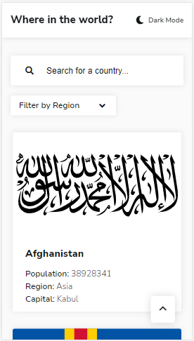
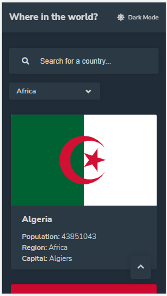
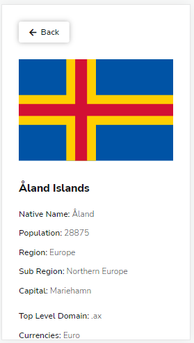
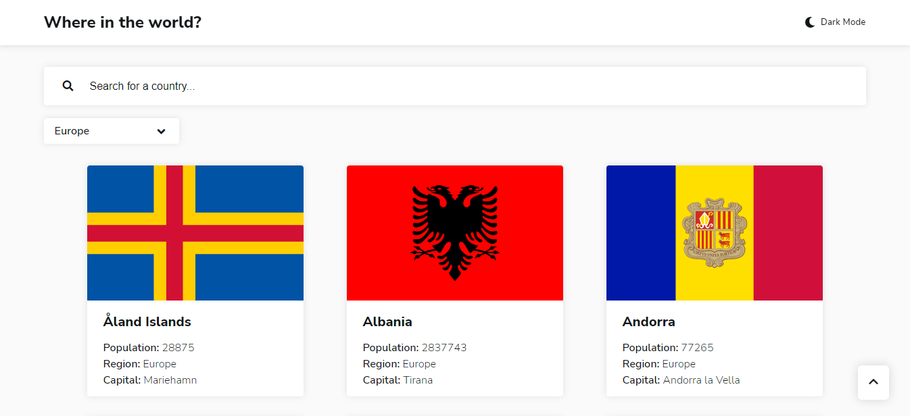

<h1 text-align="center">Rest Countries API - Hub</h1>

Um site que disponibiliza informações sobre as nações do mundo, através da <a href="https://restcountries.com/#api-endpoints-v2">Rest Countries API<a>.

---

Este projeto foi parte do desafio <a href="https://www.frontendmentor.io/challenges/rest-countries-api-with-color-theme-switcher-5cacc469fec04111f7b848ca/">REST Countries API with color theme switcher</a> da plataforma FrontEnd Mentor.

 <a href="#desafio">O desafio</a> | 
 <a href="#tecnologias">Tecnologias</a> | 
 <a href="#identidade">Identidade</a> | 
 <a href="#links">Links</a> |
 <a href="#redes">Redes</a>

---

### Visão Geral

#### O desafio

O usuário pode:

- Usufruir do layout do aplicativo independente do tamanho da tela (Design Responsivo);
- Ver todos os países disponibilizados pela API;
- Procurar por um país específico na barra de pesquisa;
- Filtrar os países por região;
- Clicar em um país na lista para informações mais detalhadas;
- Clicar nos países na seção "border countries" (países de fronteira) para também ver informações detalhadas sobre eles;
- Escolher entre tema claro e escuro.

---

#### Tecnologias

- HTML5 semântico
- Propriedades CSS customizadas
- Flexbox
- SASS Compiler
- Mobile-first Workflow
- JavaScript

---

#### Identidade

<h4>Modo claro</h4>

<h4>Modo Escuro</h4>

<h4>Informações detalhadas</h4>

<h4>Informações detalhadas</h4>

<h4>Desktop</h4>

 

---

#### Links

<a href="https://oliverids.github.io/rest-countries-api-hub/" target="_blank">Live Site URL</a>

#### Redes

Perfil do FrontEnd Mentor - <a href="https://www.frontendmentor.io/profile/oliverids">@oliverids</a>

